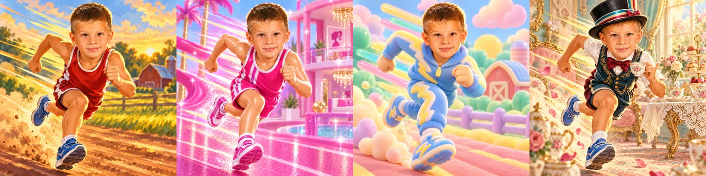
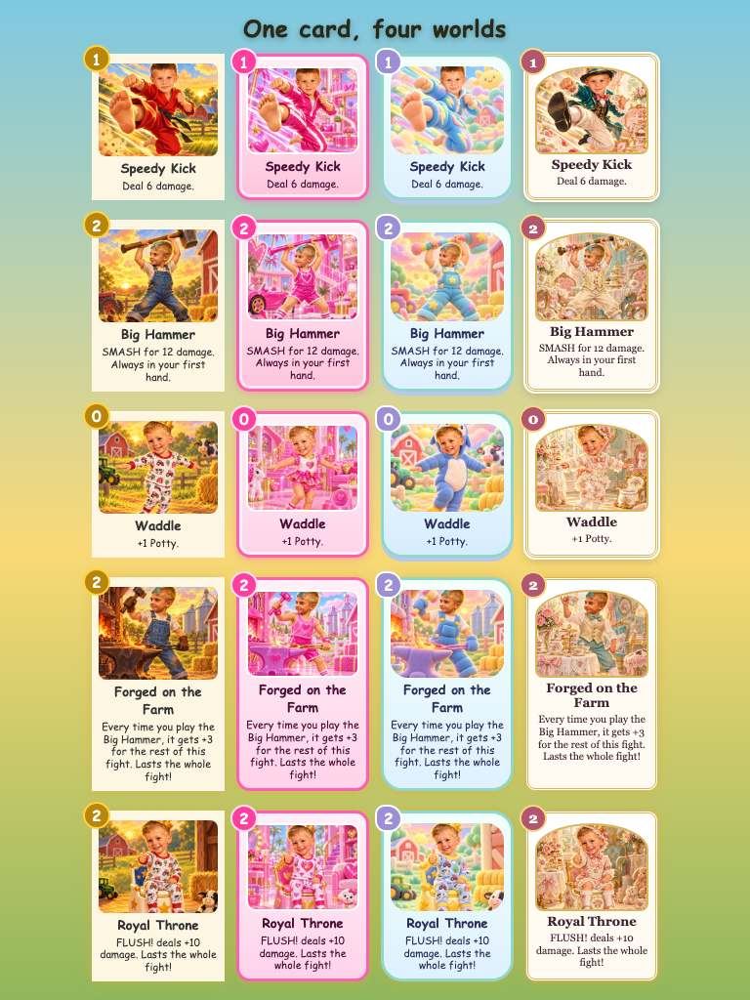

# REVIEW — items for James

Everything here shipped with Hugo's best call; nothing blocks. Read top to bottom: the first section is what needs your eyes most.

## 1. Your calls (decided Sun 2026-09-27)

- **Soundtrack: 9 tracks** (GOAL.md listed ~11). James's call Sun 2026-09-27: the first 6 (title, one theme per world, a shared tough-fight theme, the ending song) plus **a theme per cousin** (Stella 1:39, Lucy 2:02, Delilah 1:54): 9 Suno downloads used this cycle, 9 left until **Tue 2026-10-06**. Separate per-world map themes are still an easy drop-in later.
- **The secret (James's pick):** on each cousin's boss intro, tap her portrait 3 times; she winks, whispers a secret line, and slips you 💰10 (once per cousin per run). The crown screen says how many of the 3 you found. Lines in §7.

## 2. Gaps & personalization report

| Gap | What shipped | What would help |
|---|---|---|
| Stella's and Lucy's photos are low-res (~200 px faces, 450×600 originals) | Likenesses painted from them; the Oct 2025 family photo (from Savanah's post you downloaded) was added as a reference for all three girls | Sharper individual photos → regenerate the cousin portraits |
| **Lucy looked like another cousin; Stella's hair came out white, then too golden** (your notes, Sun 2026-09-27) | Close-up face crops of each girl made from her photos; the title and the three-girls ending still repainted from them: **Stella light natural blonde** (not white, not golden); **Lucy with her real darker honey-blonde bun, brown eyes, heart-shaped face**. A photo-accurate Lucy boss portrait was painted too; **James kept the current one** (Sun 2026-09-27). The repaint stays in `assets/originals/bosses/_candidates/lucy_v2.png` | — |
| Liam's portrait | Painted from the recent pajama photo; **Liam is always fully clothed** in every painting | — |
| **Two Liam cards came out in underwear** (Dreamhouse *All By Myself* and *Splash Zone*; the doll-outfit costume + a "bath water" subject) | Caught in the final art check; the clothing rule is now in every Liam card prompt, *Splash Zone* became a pajamas-and-rain-boots puddle stomp in all four looks, and both were repainted. Every Liam card in every look was re-checked | — |
| **Two paintings were another job's image** (a race in the image tool's parallel mode) | An audit matched all ~380 outputs to the session that made them: 2 mismatches (*Splash Zone* farm, *Sharpen* tea party), both repainted; everything else verified. Tool fix flagged separately | — |
| **Barbie logos in the Dreamhouse art** (found by the smoke tour, Sun 2026-09-27) | The image model copied the Barbie wordmark / doll-head logo into 38 World-1 paintings (walls, jerseys, sneakers, coins, Liam's pajamas). CLAUDE.md: name-brand toys yes, copied logos no, so the Dreamhouse style now says "original hearts, stars, bows, crowns — never a logo", and all 38 were repainted; Stella's boss portrait got a frame-only edit so her look didn't change. The logo versions are kept locally in `assets/originals/_logo/` | — |
| Coach James (the tip bubble) | Reuses the RL3 portrait (it's you) | — |
| Savanah | Painted from the family photo; appears in the ending (the car) | — |

## 3. Deviations from the design (the boys' ideas first)

| Idea (who) | What changed | Why |
|---|---|---|
| Squishy world (Wyatt): "stress balls in general… squishy dumplings, stretchy monkeys, NeeDohs" | Shipped as designed; in-game name **NeeDoh** (your name-brand call); Wyatt said "Neetos" | — |
| Squish rule (Hugo's design) | "First hit each turn is halved" → a **per-turn squish meter** on specific enemies | Codex review: the old rule rewarded a cheap opener and hurt Aaron |
| Delilah's "Nuh-uh!" (Hugo's design) | Cancel-your-card → a **visible, breakable Nuh-Uh Shield**; she announces her next rule a turn early | Codex review: cancels feel terrible to kids |
| Money pets (Aaron) | Pets earn 3/5/7 coins, grow +1 once, carry 3 | Codex review 2: the first numbers snowballed |
| "Pay a little to battle" (Aaron) | Arena fees 25/40/60; the Arena counts as ONE fight for coins | Codex review 2: it was self-financing |
| Every path: 2 tough fights (DESIGN §4) | Every path has **1–2**: floor 5 is a tough-or-normal choice, floor 8 is always tough | Keeps a real risk/reward path choice |
| Sticker Book boss treasure | → **Sticker Pack** (3 free stickers, still one per card) | Codex review 2: two stickers per card broke the infinite-combo guards |
| Hero HP (DESIGN §3: 70 / 80 / 65) | **Wyatt 62 · Aaron 74 · Liam 58** | Harness tuning to the ~25% target with parity |
| Boss/enemy numbers | Stella 130 HP (design 160), Lucy 200 (design 280), Delilah 260 + TANTRUM 180; tough fights ~+20% HP | Harness: Stella was 65% of all deaths; World 3 almost never killed |
| Card names | 9 renamed for the no-port rule (they matched RL2/RL3): Kick→**Speedy Kick**, Dodge→**Swerve**, Slide Tackle→**Scissor Kick**, Hat Trick→**Three-Peat**, Uppercut→**Haymaker**, Brace→**Turtle Up**, Sippy Cup→**Apple Juice**, Blanket Fort→**Pillow Fort**, Wiggle→**Hop Hop** | No-port test |
| "Forged in Rolfe" (DESIGN §3) and Wyatt's "Fastest feet in Rolfe" | → **Forged on the Farm** · "Fastest feet on the farm" | CLAUDE.md: no real place names beyond "the farm" (RL1–3 only ever used Rolfe in the series title) |
| Sass Level 3 | "Pets earn 1 less" was too weak; now "tough fights +12% HP" (pets-earn-less folded into level 7) | Ladder rail |
| The ending video's per-hero opening (DESIGN §9: "window leap vs. waddle") | One shared 2:33 video; the per-hero opening is the in-game ending scene that plays right before it (Wyatt leaps, Aaron jumps, Liam waddles out the door), then the song video | Three near-identical 18 MB videos would triple the download for one shot; the scene already varies |
| Random map events | None in v1 (DESIGN §4 already said so) | Scope; the visitor + Arena carry the variety |

## 4. Words for your pass (all drafted, all shipped)

The complete text, in play order, is **§7 below** (generated from the code). The lines most worth your eyes:

- **Cousin boss intros** (`js/game.js` BOSS_LINES): Stella — *"Welcome to MY Dreamhouse. Everyone here does what the Queen says."* · Lucy — *"Took you long enough! Now meet my squishies."* · Delilah — *"Nuh-uh. My party. My rules."*
- **Outplayed lines**: Stella — *"Fine. You can visit my Dreamhouse ANY time."* · Lucy — *"Okay okay, that was pretty squishy of you."* · Delilah — *"…Nuh-uh." (she lost)*
- **Visitors** (`js/worlds.js`): Grandma Rockie — *"Well, look at this place! Pink as a flamingo…"* · Grampa Flaj — *"Whoa-ho! Everything's bouncy in here!…"* · Mom and Dad — *"We are SO proud of you. Last stretch, bud…"*
- **World story cards** (`js/worlds.js` story), **ending captions** (`js/scenes.js` endingShots — Wyatt's ending, shot by shot), **crown lines per hero** (`js/game.js` showCrown), **Coach James tips + loss lines** (`js/tips.js`).
- **The ending song lyrics**: `assets/lyrics/ending.txt` ("Attack of the Cousins"; sung spellings Whyatt / Leeum / Savannah for pronunciation — the captions show Wyatt / Liam / Savanah).

## 5. Build facts

**Images: generated vs planned.**

- **Planned:** 344 paintings in `tools/art_jobs.py`:
  - cards: 229 (57 cards × 4 looks, plus Sass)
  - enemies and cousins: 36 (including Lucy's Mega Squish and Delilah's TANTRUM)
  - pets: 24 (each pet in its home world and every later world)
  - world backgrounds: 21 (7 rooms × 3 worlds)
  - hero portraits: 12 (3 heroes × 4 looks)
  - ending stills: 9
  - world-jump stills: 5
  - visitors: 3
  - UI: title, 3 KO pictures, app icon
- **Shipped:** 344 of 344, **none left on emoji.** `node tools/art_audit.mjs` finds 355/355 art and music hooks present, including the video. The smoke tour found 0 emoji and 0 fallback paintings across 82 screens.
- **Generations:** 379 runner generations plus about 7 hand-run likeness edits (the title and three-girls repaints, Stella's frame edit, the Lucy candidate):
  - 38 logo repaints and 6 content fixes (§2)
  - 2 stalled attempts killed and retried
  - 0 plan-limit pauses and 0 moderation blocks
- **Verified:** an audit matched every painting to the image-tool session that made it (§2).
- **Cost:** $0 marginal (codex backend on your ChatGPT plan).
- **Deployed size:** 32 MB of art, 13 MB of music, and the 18.7 MB video. Full-res originals and reference photos stay local (gitignored).

**Style gate.** Wyatt through all four looks, and five cards × four looks in the game's own frames, at tablet and phone size:





**Music and video.**

- 9 Suno tracks (title, 3 worlds, tough fights, 3 cousin themes, the ending song), take 1 each, all 128 kbps. Word-level `ending.lrc` (305 words).
- The ending music video: 2:33, 1280×720 H.264, made with the music-video skill from the game's own paintings, with no new images. Audio sync was measured at 0 ms. It hasn't been listened to yet, so watch it with the boys. Its project lives at `~/code/202609-rl4-ending-video/` (with a README), and copies are in the vault's `media/videos/`.

**Tests.**

- 565 unit tests
- `node test/selfplay.mjs 150`: rails ALL CLEAR, plus the Sass ladder
- e2e 153/153 in Chromium + WebKit, including a full three-world run, offline boot, the ending video path, and the cousins' secret
- smoke tour: every screen in every look, `docs/smoke/`

## 6. Publish checklist (Phase 8): done Sun 2026-09-27

**Live at <https://jmoranii.github.io/rolfe-legends-4/>** (verified 2026-09-27). The public repo got one squashed commit; the full build history stays on the Mac in the `build-history` branch. Still yours: step 3 (install on the tablets) and watching the video with the boys.


0. **One choice first (Hugo's rec: yes).** Four early local commits still contain the 38 Dreamhouse paintings *with* the copied Barbie logos (replaced before ship; the current files are clean). To keep them out of the public history, push a single squashed commit and keep the full build history on a local-only branch:
   `git -C ~/code/rolfe-legends-4 branch build-history && git -C ~/code/rolfe-legends-4 checkout --orphan release && git -C ~/code/rolfe-legends-4 commit -m "Rolfe Legends 4: Attack of the Cousins" && git -C ~/code/rolfe-legends-4 branch -M release main` (then push `main` only; `build-history` stays on the Mac).
1. Create the public repo `jmoranii/rolfe-legends-4` and push (`git -C ~/code/rolfe-legends-4 push -u origin main`). Reference photos and full-res originals are gitignored — verify with `git ls-files | grep -c ref-photos` → 0.
2. GitHub Pages from `main` / root → `https://jmoranii.github.io/rolfe-legends-4/` (same origin as RL1–3, so the tablets' parental-control exception should already cover it).
3. On a tablet: play to World 2 once online (the service worker caches as it goes), then check it runs offline; Settings → 📲 to add it to the home screen.
4. The ending music video (`assets/video/ending.mp4`, 18.7 MB, 2:33) streams on demand. It's never precached; offline it falls back to the in-game karaoke credits. Watch it once with the boys from Movies → 🎵 The Song.
5. The service worker only cleans its own `rolfe-legends-4-vN` caches (the shared-origin fix) — RL1–3 offline copies are safe.

## 7. The whole script — every line the boys will read or hear

Generated from the game's code, in play order. Edit the code, then rerun `node tools/script.mjs`.

<!-- script:start (node tools/script.mjs) -->
### The farm (every run starts here)

- **Story card:** BACK ON THE FARM — Just a normal day on the farm…
- **Wyatt the Speedy:** Wyatt the Speedy is ready for anything… until a SPARKLY PINK PORTAL opens in the barn door! 💗
- **Aaron the Strong:** Aaron the Strong is ready for anything… until a SPARKLY PINK PORTAL opens in the barn door! 💗
- **Liam the Potty Trained:** Liam the Potty Trained is ready for anything… until a SPARKLY PINK PORTAL opens in the barn door! 💗
- **Hero pick:** Who takes on the cousins?
- **Wyatt the Speedy (tagline):** Fastest feet on the farm. The more cards he plays, the faster he gets.
- **Aaron the Strong (tagline):** Brings the Big Hammer to every fight — and makes it BIGGER.
- **Liam the Potty Trained (tagline):** A big kid now. Fill the Potty meter… then FLUSH!

### World 1: The Barbie Dreamhouse

- **World-jump:** 💗 WHOOSH! You got plunged into a giant BARBIE DREAMHOUSE!
- **Story card:** You got plunged into a giant Barbie Dreamhouse! Everything is pink, shiny, and plastic — and Stella, the Queen of Barbies, rules it all. Watch out: Enemies here hit a LOT — Block matters!
- **Grandma Rockie:** "Well, look at this place! Pink as a flamingo. Here, sweetie — pick one. Grandma always brings something."
- **Stella, Queen of Barbies (boss intro):** "Welcome to MY Dreamhouse. Everyone here does what the Queen says." 👑
- **Stella (secret wink: tap her portrait 3× on her intro, +💰10):** "Psst… don't tell anyone, but the Queen likes you. Here — for your outfit fund." 😉👑
- **Stella (outplayed):** "Fine. You can visit my Dreamhouse ANY time." — Stella 👑
- **Money pets:** 🐩 Pink Poodle: “Fluffy, fabulous, and somehow always holding a coin.” · 🦄 Pony Pal: “A sparkly pony who finds coins in the carpet.” · 🐱 Glitter Kitten: “Leaves a trail of glitter… and pennies.” · 🐰 Dream Bunny: “Hops into the Dreamhouse bank and hops out richer.”

### World 2: Inside the Giant Squishy

- **World-jump:** 🫧 SLURP! A giant squishy just SWALLOWED you!
- **Story card:** Uh-oh. You got SWALLOWED by a giant squishy! Fight your way through the squishy toys, squeeze out the other side… Lucy is waiting. Watch out: Squishy enemies soak up the first bit of damage each turn — save up for BIG turns!
- **Grampa Flaj:** "Whoa-ho! Everything's bouncy in here! Careful, kiddo. Pick one of these — they'll help."
- **The Squeeze Out:** You squeezed and squeezed… and squeezed OUT!
- **The Squeeze Out:** …and **Lucy** was waiting for you. 🫧👑
- **Lucy, Ruler of Squishies (boss intro):** "Took you long enough! Now meet my squishies." 🫧
- **Lucy (secret wink: tap her portrait 3× on her intro, +💰10):** "Okay, secret: I squished these coins out of a NeeDoh. Shhh!" 😉🫧
- **Lucy (outplayed):** "Okay okay, that was pretty squishy of you." — Lucy 🫧
- **Money pets:** 😺 Squishy Kitten: “Squeeze it and a coin pops out. Every time.” · 🐶 Dumpling Pup: “A puppy shaped like a dumpling. Loves fetch. Fetches coins.” · 🐢 Jelly Turtle: “Slow. Squishy. Surprisingly good with money.” · 🐹 Mochi Hamster: “Stuffs its cheeks with coins, then shares.”

### World 3: Delilah's Sassy Tea Party

- **World-jump:** 🫖 Ahem. You have arrived at the fanciest tea party EVER.
- **Story card:** Welcome to the fanciest tea party EVER. Pinkies out. Manners on. Delilah makes the rules — and she changes them whenever she wants. Watch out: Tea Party Rules! Break the rule and you get a Sass card.
- **Mom and Dad:** "We are SO proud of you. Last stretch, bud. Pick one — then go show her who's boss."
- **Delilah the Sassafras (boss intro):** "Nuh-uh. My party. My rules." 💅
- **Delilah (secret wink: tap her portrait 3× on her intro, +💰10):** "Nuh-uh… okay, UH-HUH. One secret. Don't make it weird." 😉💅
- **Delilah (outplayed):** "…Nuh-uh." — Delilah (she lost) 💅
- **Money pets:** 🐷 Teacup Pig: “Tiny pig. Tiny teacup. Big savings.” · 🦜 Fancy Parrot: “Says "Pretty please" and people just give it coins.” · 🐑 Lace Lamb: “Wears a doily. Collects coins politely.” · 🐕 Royal Corgi: “Has a crown AND a coin purse.”

### The ending (Wyatt’s design, shot by shot; the second shot depends on the hero)

- **Shot 1:** Delilah is beaten… she cracks open a window… and JUMPS OUT! 🪟
- **Shot 2 (wyatt):** …and WYATT THE SPEEDY leaps right out the window after her! ⚡
- **Shot 2 (aaron):** …and AARON THE STRONG jumps right out the window after her! 💪
- **Shot 2 (liam):** …and LIAM opens the door and waddles right out. 🚪🐧
- **Shot 3:** Outside: the big gravel patch. The barn. The grain bins. Goldie in her fence. The tea party was inside YOUR house the whole time! 🏡
- **Shot 4:** Stella and Lucy run over to stand by Delilah. 👑🫧💅
- **Shot 5:** Then Aunt Savanah pulls up in her shiny gray car… 🚗✨
- **Shot 6:** …picks up the girls, and drives away down the lane through the trees. 👋
- **Shot 7:** The cousins will be back someday. But today? The LEGENDS win! 🏆
- **Crown (wyatt):** "Stella was fabulous. Lucy was squishy. Delilah was SASSY. But nobody is faster than WYATT THE SPEEDY!" ⚡
- **Crown (aaron):** "Three worlds. Three cousins. One Big Hammer. AARON THE STRONG!" 🔨
- **Crown (liam):** "Delilah said nuh-uh. Liam said FLUSH. LIAM THE POTTY TRAINED!" 🚽

### Coach James (tips after fights, and after a loss)

- **After a win:** Nice work! [enemy]? Handled. · THAT'S how it's done. [enemy] is done for. · Look at you go! [enemy] didn't stand a chance.
- **Tip:** Look at the bubble over each enemy — it tells you EXACTLY what it will do next.
- **Tip:** Block only lasts one turn. Block when a big hit is coming, attack when it isn't.
- **Tip:** Money pets pay you after EVERY fight you win. More pets, more coins.
- **Tip:** A tough fight (💀) always drops a money pet. Risky… but worth it.
- **Tip:** The Arena costs coins to enter, but the prize is a SUPER pet or a rare card.
- **Tip:** Stickers stay on a card for the whole run. Put your best sticker on your best card!
- **Tip:** Removing weak cards makes your good cards show up more often.
- **Tip:** Tap anything you don't understand — every chip and bubble explains itself.
- **Tip:** Squishy enemies soak up the first bit of damage each turn. Save up for one BIG turn!
- **Tip:** In the Tea Party, a card that would break the rule glows orange first. Your call!
- **Tip:** Got a Sass card? Tap it and Say Sorry for 1 ⚡ to toss it.
- **Tip:** Your whole deck travels with you to the next world — every card you pick matters.
- **Tip (wyatt):** Momentum goes up with EVERY card you play this turn. Play the cheap cards first!
- **Tip (wyatt):** Cards that say "Momentum 3+" get way better as your third, fourth, fifth card.
- **Tip (wyatt):** Photo Finish gets cheaper the faster you go. Save it for the end of a big turn.
- **Tip (aaron):** Make the Big Hammer bigger BEFORE you swing it — Sharpen, Temper, Anvil!
- **Tip (aaron):** Wide Swing makes the Big Hammer hit EVERY enemy for the rest of the fight.
- **Tip (aaron):** Iron Stance turns a huge hammer into huge Block.
- **Tip (liam):** Watch the Potty meter. When it hits 10… FLUSH! It hits every enemy.
- **Tip (liam):** Hold It! spends Potty for a big shield — sometimes that beats flushing.
- **Tip (liam):** Royal Throne makes every FLUSH! hit even harder.
- **After a loss:** Every legend loses a few. Shake it off — the cousins won't know what hit them next time.
- **After a loss:** That was close! Try a different path, or a different hero.
- **After a loss:** Remember what beat you. Next time, you'll see it coming.
- **After a loss:** Rest up, champ. The Dreamhouse will still be pink tomorrow.

### The ending song — “Attack of the Cousins” (as sung; the on-screen captions spell Wyatt, Liam, Savanah)

```
[Intro]
Rolfe Legends! Here we go!

[Verse 1]
We got plunged in a Dreamhouse, pink from floor to sky
Stella in her ballgown with her tiara riding high
Whyatt ran so fast the mannequins fell down
Aaron swung the Big Hammer, the loudest sound in town

[Pre-Chorus]
Three cousins, three worlds, one deck in our hand
Leeum filled the Potty meter, FLUSH across the land!

[Chorus]
It's the Attack of the Cousins!
Queen of the Barbies, Ruler of Squish
The littlest one's the sassiest, and she got her wish
It's the Attack of the Cousins!
We played our cards, we stood our ground
Now the whole farm's singing, sing it loud!

[Verse 2]
Swallowed by a squishy, we bounced our way through
Stretchy monkeys snapping and the NeeDohs squeezed us too
We squeezed out the other side, and who was waiting there?
Lucy on her throne of squish, a crown upon her hair

[Verse 3]
Then a tea party, pinkies out, the fanciest of all
Delilah made the rules up, "Nuh-uh!" she would call
She flipped the table over, teacups in the air
But we said sorry, played it smart, and beat her fair and square

[Bridge]
She cracked open the window and she jumped right out
Whyatt leapt, Aaron leapt, Leeum waddled out the door
Gravel on the farm and Goldie by the fence
Stella and Lucy running over, now it all makes sense

[Verse 4]
Aunt Savannah pulled up in her shiny gray car
Picked up the girls and waved, "You're superstars!"
Down the lane through the trees they rolled away
The cousins will be back another day!

[Final Chorus]
It's the Attack of the Cousins!
Queen of the Barbies, Ruler of Squish
The littlest one's the sassiest, and she got her wish
It's the Attack of the Cousins!
We played our cards, we stood our ground
Now the whole farm's singing, sing it loud!

[Outro]
Rolfe Legends!
```
<!-- script:end -->
